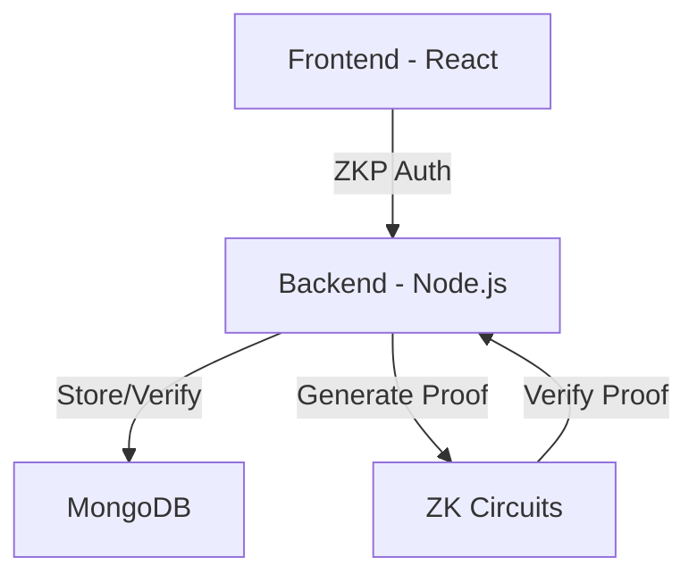

# ZKP Authentication System

A secure authentication system using Zero-Knowledge Proofs (ZKP) with a React frontend and Node.js backend.

## 🚀 Features

- Zero-Knowledge Proof based authentication
- Real-time verification status updates
- User profile management
- Verification history tracking
- Docker containerization
- MongoDB database integration

## 🏗️ Architecture



## 🛠️ Tech Stack

- **Frontend:**
  - React 18
  - Chakra UI
  - React Router v6
  - Axios
  - WebSocket for real-time updates

- **Backend:**
  - Node.js
  - Express
  - MongoDB
  - ZK-SNARKs
  - WebSocket Server

- **DevOps:**
  - Docker
  - Docker Compose
  - MongoDB

## 📦 Prerequisites

- Docker & Docker Compose
- Node.js >= 18
- npm >= 9
- Git

## 🚀 Quick Start

1. **Clone the repository**
```bash
git clone https://github.com/nonzzo/zkp-auth-system.git
cd zkp-auth-system
```

2. **Set up environment variables**
```bash
cp .env.example .env
# Edit .env with your configuration
```

3. **Start the application**
```bash
docker-compose up -d
```

The application will be available at:
- Frontend: http://localhost:3000
- Backend API: http://localhost:5000
- MongoDB: localhost:27017

## 💻 Development

### Running Locally

**Frontend:**
```bash
cd frontend
npm install
npm start
```

**Backend:**
```bash
cd backend
npm install
npm run dev
```

### Building Docker Images

```bash
docker-compose build
```

## 📝 API Documentation

### Authentication Endpoints

```http
POST /api/auth/register
POST /api/auth/login
POST /api/auth/verify-proof
GET /api/user/verification-stats/:userId
```

## 🔒 Security

- Zero-Knowledge Proofs for password verification
- JWT for session management
- Environment variables for sensitive data
- Secure WebSocket connections
- CORS protection
- Rate limiting


## 🤝 Contributing

1. Fork the repository
2. Create your feature branch
3. Commit your changes
4. Push to the branch
5. Open a Pull Request

## 📄 License

This project is licensed under the MIT License - see the [LICENSE](LICENSE) file for details.

## 👥 Contributors

- Nonso (@nonzzo)

## 🙏 Acknowledgments

- ZK-SNARKs library contributors
- React and Node.js communities
- MongoDB team