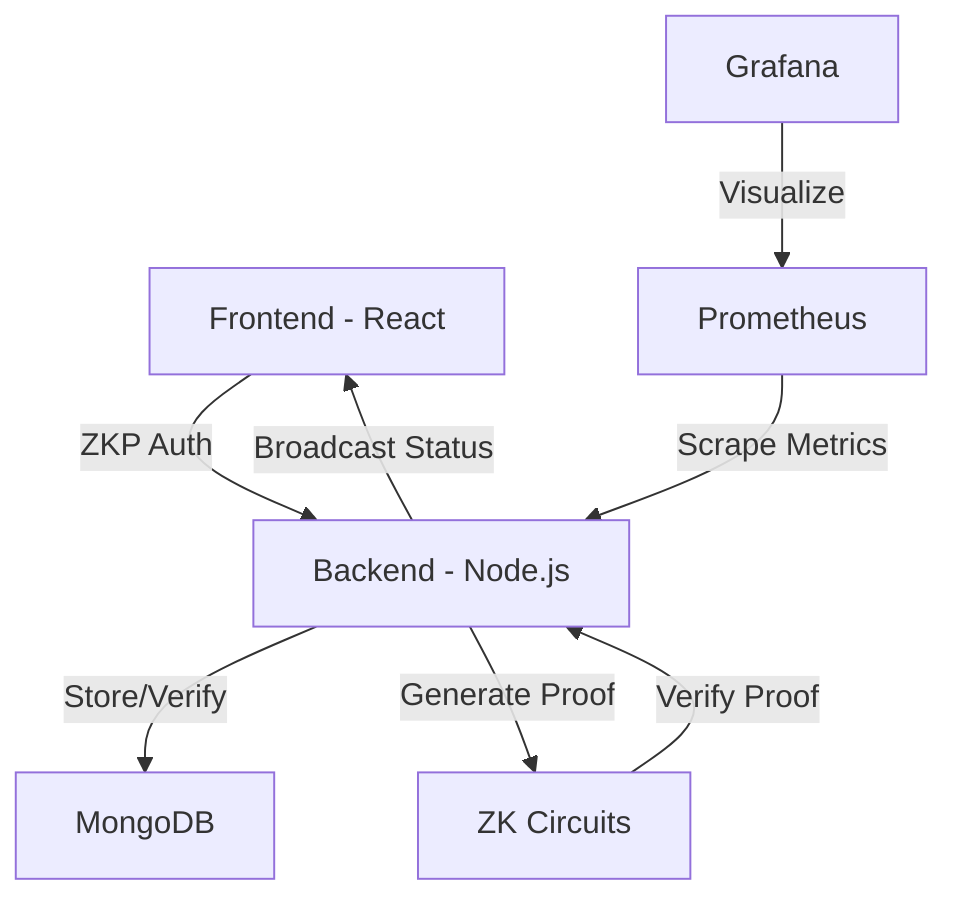

# ZKP Authentication System

A secure authentication system using Zero-Knowledge Proofs (ZKP) with a React frontend, Node.js backend, and real-time WebSocket updates.

## 🚀 Features

- ✅ **Zero-Knowledge Proof Authentication** - Password verification without revealing the password
- ✅ **Real-Time Verification Status** - WebSocket-based live updates during login
- ✅ **User Profile Management** - View verification history and success rates
- ✅ **Verification Tracking** - Track all login attempts and success metrics
- ✅ **Prometheus & Grafana Monitoring** - Real-time metrics and dashboards
- ✅ **Cryptographic Security** - Key rotation, audit logging, session encryption
- ✅ **Docker Containerization** - Easy deployment with docker-compose
- ✅ **MongoDB Integration** - Persistent user and verification data

## 🏗️ Architecture



## 🛠️ Tech Stack

### Frontend
- React 18
- Chakra UI
- React Router v6
- Axios
- WebSocket for real-time updates

### Backend
- Node.js v18
- Express
- MongoDB with Mongoose
- ZK-SNARKs (snarkjs + circomlibjs)
- WebSocket Server
- Prom-client for metrics

### Monitoring & DevOps
- Docker & Docker Compose
- Prometheus (metrics collection)
- Grafana (metrics visualization)
- AlertManager (alert routing)
- MongoDB Exporter

## 📦 Prerequisites

- Docker & Docker Compose
- Node.js >= 18
- npm >= 9
- Git
- 4GB RAM minimum

## 🚀 Quick Start

### 1. Clone the repository
```bash
git clone https://github.com/nonzzo/zkp-auth-system.git
cd zkp-auth-system
```

### 2. Set up environment variables
```bash
cp .env.example .env
# Edit .env with your configuration
```

### 3. Start with Docker Compose
```bash
docker-compose up -d
```

### 4. Access the application

| Service | URL | Credentials |
|---------|-----|-------------|
| Frontend | http://localhost:3001 | N/A |
| Backend API | http://localhost:5000 | N/A |
| MongoDB | localhost:27017 | See `.env` |
| Prometheus | http://localhost:9090 | N/A |
| Grafana | http://localhost:3000 | admin/admin |
| AlertManager | http://localhost:9093 | N/A |

## 💻 Development

### Running Locally

**Backend:**
```bash
cd backend
npm install
npm run dev
```

**Frontend:**
```bash
cd frontend
npm install
npm start
```

### Building Docker Images
```bash
docker-compose build
```

## 📝 API Documentation

### Authentication Endpoints

#### Register User

```bash
curl -X POST http://localhost:5000/api/auth/register \
  -H "Content-Type: application/json" \
  -d '{
    "username": "user@example.com",
    "password": "secure_password"
  }'
```
Response: 200 OK
```json
{"message":"✅ Registration successful!","userId":"69392XXXXXXXXXXae6X4"}%
```

#### Login with ZKP
```bash
curl -X POST http://localhost:5000/api/auth/login \
  -H "Content-Type: application/json" \
  -d '{
    "username": "user@example.com",
    "password": "secure_password"
  }'
```

Response: 200 OK
```json
{
  "message": "✅ Authentication successful!",
  "token": "dXNlckBleGFtcGxlLmNvbS0xNzMzNjU5MjU5MzE1",
  "username": "user@example.com",
  "userId": "507f1f77bcf86cd799439011",
  "session": "encrypted_session_data"
}
```

#### Generate Proof
```bash
curl -X POST http://localhost:5000/api/auth/generate-proof \
  -H "Content-Type: application/json" \
  -d '{
    "username": "user@example.com",
    "password": "secure_password"
  }'
```

Response: 200 OK
```json
{
  "proof": { "pi_a": [...], "pi_b": [...], "pi_c": [...] },
  "publicSignals": [...]
}
```

#### Verify Proof
```bash
# First generate proof (see above), then verify it
curl -X POST http://localhost:5000/api/auth/verify-proof \
  -H "Content-Type: application/json" \
  -d '{
    "proof": { "pi_a": [...], "pi_b": [...], "pi_c": [...] },
    "publicSignals": [...]
  }'
```

Response: 200 OK
```json
{
  "message": "✅ Authentication successful!"
}
```

#### Get User Verification Stats
```bash
TOKEN="your_token_from_login"
USER_ID="your_user_id_from_login"

curl http://localhost:5000/api/user/verification-stats/$USER_ID \
  -H "Authorization: Bearer $TOKEN"
```

Response: `200 OK`
```json
{
  "_id": "69392d8573378091d5bb7ff2",
  "userId": "69392cfaa78289b9a3aae634",
  "totalVerifications": 1,
  "successfulVerifications": 1,
  "failedVerifications": 0,
  "lastVerified": "2025-12-10T08:21:25.357Z",
  "createdAt": "2025-12-10T08:21:25.358Z",
  "updatedAt": "2025-12-10T08:21:25.358Z"
}
```

### Metrics Endpoints

#### Prometheus Metrics
```bash
curl http://localhost:5000/metrics
```

Response: `200 OK`
```
# HELP zkp_proof_generation_seconds Time taken to generate a ZK proof in seconds
# TYPE zkp_proof_generation_seconds histogram
zkp_proof_generation_seconds_bucket{le="0.1",status="attempt"} 2
zkp_proof_generation_seconds_bucket{le="0.5",status="attempt"} 5
zkp_proof_generation_seconds_sum{status="attempt"} 1.2345
zkp_proof_generation_seconds_count{status="attempt"} 5
...
```

## 🔒 Security Features

- **Zero-Knowledge Proofs** - Passwords never transmitted or stored in plaintext
- **Keccak256 Hashing** - Strong cryptographic hashing with random salt
- **Session Encryption** - Encrypted session data using AES-256
- **Key Rotation** - Automatic cryptographic key rotation
- **Audit Logging** - Complete audit trail of authentication events
- **JWT Tokens** - Secure token-based session management
- **CORS Protection** - Restricted cross-origin requests
- **Rate Limiting** - Protection against brute force attacks
- **WebSocket Security** - Secure real-time communication

## 📊 Monitoring & Metrics

### Prometheus Metrics
The backend exports the following ZKP metrics:

```
zkp_proof_generation_seconds         - Histogram of proof generation time
zkp_proof_verification_seconds       - Histogram of proof verification time
zkp_auth_attempts_total              - Counter of authentication attempts
zkp_proof_generated_total            - Counter of proofs generated
zkp_proof_verified_total             - Counter of proof verifications
zkp_active_verifications             - Gauge of active verification processes
zkp_users_registered_total           - Counter of registered users
```

#### View Metrics in Grafana
Visit http://localhost:3000 (admin/admin) and view the **ZKP Authentication Metrics** dashboard for:
- Proof generation latency (p95)
- Authentication success rate
- Total users registered
- Active verifications
- Proof verification results

### Alerts
AlertManager is configured to notify on:
- High proof generation latency (>5s)
- High authentication failure rate (>30%)
- Proof verification errors
- Service downtime

## 🔄 Workflow

1. **User Registration**
   - User creates account with username and password
   - Password is hashed using Keccak256 + random salt
   - Hash and salt stored in MongoDB

2. **User Login**
   - User provides username and password
   - Backend generates a ZK proof using the password and stored salt
   - Proof is verified using the stored password hash
   - If valid, encrypted session and JWT token are returned
   - WebSocket broadcasts real-time verification status

3. **Proof Generation**
   - Uses snarkjs + circomlibjs to generate SNARK proof
   - Proves knowledge of password without revealing it
   - Leverages Groth16 zero-knowledge proof system

4. **Metrics Collection**
   - Prometheus scrapes metrics from backend `/metrics` endpoint
   - Grafana visualizes metrics in real-time dashboards
   - AlertManager triggers alerts based on configured rules

## 🐛 Troubleshooting

### Backend not starting
```bash
# Check logs
docker logs zkp-backend

# Ensure MongoDB is running
docker logs zkp-mongodb
```

### Login fails
- Verify user is registered: `docker exec zkp-mongodb mongosh`
- Check backend logs for proof generation errors
- Ensure password matches registration password exactly

### Prometheus not scraping metrics
- Check Prometheus targets: http://localhost:9090/targets
- Verify backend is running: `curl http://localhost:5000/metrics`
- Check prometheus.yml configuration

### Grafana dashboards not loading
- Verify Prometheus datasource: Grafana → Configuration → Data Sources
- Check if metrics exist: http://localhost:9090/graph

## 📁 Project Structure

```
zkp-auth-system/
├── backend/                    # Node.js Express server
│   ├── routes/                # API endpoints
│   ├── models/                # MongoDB schemas
│   ├── utils/                 # Utilities (crypto, zkp, hashing)
│   ├── middleware/            # Express middleware
│   ├── zk-circuits/           # ZK circuit files
│   └── server.js              # Main server file
├── frontend/                  # React application
│   ├── src/
│   │   ├── components/        # React components
│   │   ├── services/          # API services
│   │   ├── context/           # React context
│   │   └── App.js             # Main app
│   └── Dockerfile
├── blockchain/                # Solidity contracts
│   ├── contracts/             # Smart contracts
│   ├── scripts/               # Deployment scripts
│   └── hardhat.config.js
├── monitoring/                # Prometheus & Grafana config
│   ├── prometheus/            # Prometheus configuration
│   ├── grafana/               # Grafana dashboards
│   └── alertmanager/          # AlertManager rules
├── docker-compose.yml         # Service orchestration
├── .env.example               # Environment variables template
└── README.md                  # This file
```

## 🚀 Deployment

### Docker Compose (Development/Testing)
```bash
docker-compose up -d
```


## 📄 License

This project is licensed under the MIT License - see the [LICENSE](LICENSE) file for details.

## 👥 Contributors

- **Nonso** ([@nonzzo](https://github.com/nonzzo)) - Project creator

## 🙏 Acknowledgments

- [snarkjs](https://github.com/iden3/snarkjs) - ZK-SNARK proving and verifying library
- [circomlibjs](https://github.com/iden3/circomlibjs) - Circom library in JavaScript
- [ZK-SNARKs Research](https://en.wikipedia.org/wiki/Zero-knowledge_proof) - Academic foundations
- React and Node.js communities
- MongoDB team
- Prometheus and Grafana teams

## 📞 Support

For issues, questions, or suggestions:
1. Check existing [GitHub Issues](https://github.com/nonzzo/zkp-auth-system/issues)
2. Create a new issue with detailed description
3. Include logs and steps to reproduce

---

**Last Updated:** December 2025
**Status:** ✅ Fully Functional